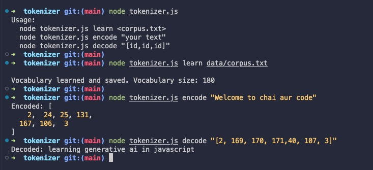

# Simple JavaScript Tokenizer (Node CLI)

A minimal **custom tokenizer** written in JavaScript for Node.js, that:

- **Learns vocabulary** from a given text corpus.
- **Encodes** text into token IDs.
- **Decodes** token IDs back into text.
- Supports **special tokens**:
  - `<PAD>` — padding  
  - `<UNK>` — unknown token  
  - `<START>` — start of sequence  
  - `<END>` — end of sequence  


## Setup

1. Make sure you have **Node.js** installed.
2. Clone or download this project.
3. Place your learning corpus in a file named `data/corpus.txt`.
4. Run the learning command to generate or update the vocabulary file.


## Usage

### `learn`: Learn Vocabulary
This reads words from your training corpus file (`data/corpus.txt`),
generates a mapping from words to unique token IDs, and saves it to `data/vocab.json`.
```bash
node tokenizer.js learn data/corpus.txt
# Vocabulary learned and saved. Vocabulary size: 180
```


### `encode`: Encode Text → Token IDs
This converts a text string into a sequence of numeric IDs based on the learned vocabulary.
```bash
node tokenizer.js encode "Welcome to chai aur code"
# Encoded: [ 2,  24, 25, 131, 167, 106, 3 ]
```


### `decode`: Decode Token IDs → Text
This converts a list of IDs back into natural text.
```bash
node tokenizer.js decode "[2, 169, 170, 171,40, 107, 3]"
# Decoded: learning generative ai in javascript
```

## Example Workflow
```bash
# Learn vocabulary
node tokenizer.js learn corpus.txt  

# Encode a sentence
node tokenizer.js encode "chai aur code is awesome"

# Decode token IDs back to text
node tokenizer.js decode "[2,90,45,102,87,3]"
```


## Output Screenshot



## Project Files
- `tokenizer.js` — main CLI tokenizer script.
- `data/corpus.txt` — sample training text.
- `data/vocab.json` — generated vocabulary mapping words → token IDs.
- `utils/index.js` — utility functions.
- `README.md` — project documentation.


## Notes
- You can re-run the **learn** command to update `vocab.json` with new words.
- Unknown words in `encode` will be mapped to `<UNK>`.
- Start and end tokens are always automatically added in encoding.


## Next Step

- Use byte pair encoding (BPE) method for better handling of unseen words.
- Instead of loading the entire corpus into memory, process it in chunks for large datasets.
- Typescript support
